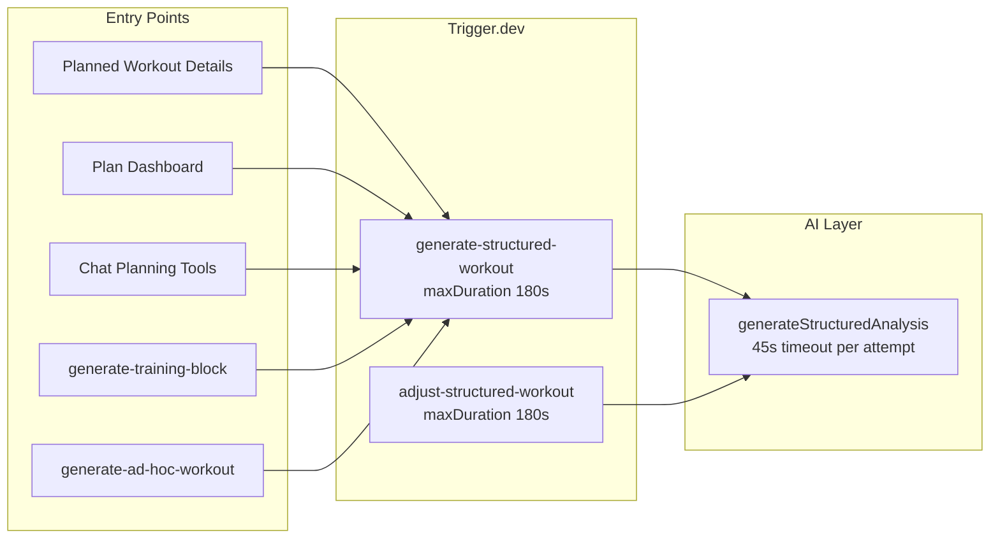

# Workout Details Generation — Issue Tracker

Last reviewed: 2026-07-07 (implementation in progress — see PRs #214–#218)

This tracker documents bugs, UX gaps, and architectural concerns found during a code review of **planned workout structure generation** (the AI pipeline that produces interval steps, strength blocks, coach instructions, and related metadata for the Planned Workout Details page).

Implementation PRs are open as draft — see status column below. Original review was documentation-only.

## Scope

**In scope**

- `generate-structured-workout` and related Trigger.dev tasks
- API endpoints that enqueue structure generation
- Planned Workout Details UI monitoring and feedback
- Chat planning tools that trigger background generation
- Timeout and retry behavior for AI calls inside triggers

**Out of scope (related but separate)**

- Completed workout AI analysis (`analyze-workout`)
- Read-only chat tools (`get_workout_details`, `get_planned_workout_details`)
- Intervals.icu publish/sync failures (deferred in support tracker)

## Architecture Summary

Chat turns have a separate **60s execution timeout** (`CHAT_TURN_EXECUTION_TIMEOUT_MS`). Structure generation is correctly offloaded to Trigger.dev in most paths, but several triggers still run **synchronous multi-attempt AI** inside the task body, which can approach the 180s task cap.

## Production Context

Prior support investigation confirms an active defect family around **zero-step structured workouts** (description-only `structuredWorkout` payloads with `step_count = 0`). See:

- [support-ticket-task-list-2026-06-16.md](../06-plans/support-ticket-task-list-2026-06-16.md) — cluster 3
- [support-ticket-handoff-2026-06-25.md](../06-plans/support-ticket-handoff-2026-06-25.md)

Anchor support tickets: `0d62fa04-884d-4fcd-a328-2226f2eb4ad5`, `a232e0ab-245e-4e95-ac37-e03fa7db6e37`, `10565730-46cd-4422-bef3-edf8b16d7df7`

## Issues

| ID                                                           | Title                                                           | Priority | Type         | Status                                                              |
| ------------------------------------------------------------ | --------------------------------------------------------------- | -------- | ------------ | ------------------------------------------------------------------- |
| [001](./001-zero-step-structure-persistence.md)              | Empty structures can persist as successful generation           | Critical | Bug          | In Progress ([PR #214](https://github.com/hdkiller/coach/pull/214)) |
| [002](./002-missing-planned-workout-run-tags.md)             | Manual/API triggers missing `planned-workout:` run tags         | High     | Bug          | In Progress ([PR #217](https://github.com/hdkiller/coach/pull/217)) |
| [003](./003-free-tier-skip-reports-success.md)               | Free-tier skip returns `success: true` → misleading toast       | Medium   | Bug          | Open                                                                |
| [004](./004-no-task-failure-handling.md)                     | No `onTaskFailed` handler — stuck "Generating..." state         | High     | Bug          | Open                                                                |
| [005](./005-page-reload-loses-generation-state.md)           | Page reload does not restore in-progress generation UI          | Medium   | Bug          | Open                                                                |
| [006](./006-ui-timeout-messaging-mismatch.md)                | UI says "30 seconds" but task can take up to ~180s              | Low      | Bug          | Open                                                                |
| [007](./007-workout-messages-no-ai-timeout.md)               | `generate-workout-messages` has no explicit AI timeout          | Medium   | Bug          | Open                                                                |
| [008](./008-chat-silent-trigger-failures.md)                 | Chat tools swallow structure trigger failures                   | High     | Bug          | Open                                                                |
| [009](./009-double-quota-consumption.md)                     | Quota checked at API and again inside trigger                   | Medium   | Maintenance  | Open                                                                |
| [010](./010-batch-generation-loading-state.md)               | Batch week generation clears loading before jobs finish         | Medium   | Bug          | Open                                                                |
| [011](./011-strength-blocks-validation-gap.md)               | Final validation ignores `blocks`-only strength structures      | Medium   | Bug          | Open                                                                |
| [012](./012-ai-in-triggers-architecture-rethink.md)          | Rethink AI-in-triggers pattern and timeout strategy             | High     | Architecture | Open                                                                |
| [013](./013-chat-duplicate-structure-generation-triggers.md) | Chat creates multiple structure generation jobs for one workout | High     | Bug          | In Progress ([PR #218](https://github.com/hdkiller/coach/pull/218)) |
| [014](./014-idempotent-create-skips-structure-retrigger.md)  | Idempotent create replay never re-enqueues structure            | High     | Bug          | Open                                                                |
| [015](./015-approval-turn-duplicate-workouts.md)             | Approval turns / double-submit create duplicate workouts        | Critical | Bug          | Open                                                                |
| [016](./016-chat-card-infinite-poll-without-run-id.md)       | Chat card polls forever when enqueue fails without run_id       | Medium   | Bug          | Open                                                                |
| [017](./017-modify-plan-structure-planservice-crash.md)      | `modify_training_plan_structure` crashes (missing import)       | Critical | Bug          | In Progress ([PR #216](https://github.com/hdkiller/coach/pull/216)) |
| [018](./018-structure-tools-bypass-approval.md)              | `adjust` / `generate_planned_workout_structure` bypass approval | High     | Bug          | Open                                                                |
| [019](./019-chat-ui-ignores-strength-blocks.md)              | Chat UI ignores blocks-only strength structures                 | Medium   | Bug          | Open                                                                |
| [020](./020-intervals-publish-before-structure-ready.md)     | Intervals shell published before structure exists               | Medium   | Bug          | Open                                                                |
| [021](./021-recommend-workout-stub-data.md)                  | `recommend_workout` returns hardcoded stub data                 | Medium   | Bug          | Open                                                                |
| [022](./022-patch-vs-async-generation-race.md)               | Patch/set vs async generate race (last writer wins)             | Medium   | Bug          | Open                                                                |
| [023](./023-structure-tools-idempotency-gaps.md)             | `generate_` / `adjust_` / `set_` tools skip chat idempotency    | Medium   | Bug          | In Progress ([PR #218](https://github.com/hdkiller/coach/pull/218)) |
| [024](./024-chat-card-wrong-workout-fallback.md)             | Chat card fuzzy ID fallback attaches wrong workout              | Medium   | Bug          | Open                                                                |
| [025](./025-planned-workout-details-context-bloat.md)        | `get_planned_workout_details` bloats LLM context                | Low      | Bug          | Open                                                                |
| [026](./026-structure-tools-missing-preflight.md)            | Generate/adjust tools skip sync workout existence check         | Medium   | Bug          | Open                                                                |
| [027](./027-cross-user-runs-on-identity-switch.md)           | Monitor shows other user's runs after act-as / impersonation    | Critical | Bug          | In Progress ([PR #215](https://github.com/hdkiller/coach/pull/215)) |
| [028](./028-trigger-monitor-stale-run-merge.md)              | Client merge never evicts stale completed runs                  | Medium   | Bug          | In Progress ([PR #215](https://github.com/hdkiller/coach/pull/215)) |
| [029](./029-triggers-missing-user-tags.md)                   | Some triggers omit required `user:{userId}` tag                 | High     | Bug          | In Progress ([PR #217](https://github.com/hdkiller/coach/pull/217)) |
| [030](./030-library-run-tags-template-owner.md)              | Library jobs tag template owner, not session actor              | Medium   | Bug          | Open                                                                |
| [031](./031-websocket-not-reauth-on-identity-switch.md)      | WebSocket not re-authenticated on identity switch               | Medium   | Bug          | Open                                                                |
| [032](./032-trigger-tag-taxonomy-inconsistent.md)            | Inconsistent secondary tags for structure jobs                  | Medium   | Maintenance  | In Progress ([PR #217](https://github.com/hdkiller/coach/pull/217)) |
| [033](./033-retire-legacy-structure-generator.md)            | Retire `legacy_json` generator for ride/run/swim                | Medium   | Performance  | In Progress ([PR #214](https://github.com/hdkiller/coach/pull/214)) |
| [034](./034-deduplicate-structure-prompt-targeting.md)       | Deduplicate targeting instructions in structure prompts         | Medium   | Performance  | In Progress ([PR #214](https://github.com/hdkiller/coach/pull/214)) |
| [035](./035-remove-unused-streams-from-structure-context.md) | Remove unused stream fetch from structure context               | Low      | Performance  | In Progress ([PR #214](https://github.com/hdkiller/coach/pull/214)) |
| [036](./036-bound-aicontext-in-structure-generation.md)      | Bound `aiContext` in structure-generation prompts               | Medium   | Performance  | In Progress ([PR #214](https://github.com/hdkiller/coach/pull/214)) |
| [037](./037-structure-generation-lightweight-retries.md)     | Lightweight corrective retries for structure generation         | High     | Performance  | In Progress ([PR #214](https://github.com/hdkiller/coach/pull/214)) |
| [038](./038-disable-thinking-flash-structure-generation.md)  | Disable/minimize Flash thinking for structure generation        | Medium   | Performance  | In Progress ([PR #214](https://github.com/hdkiller/coach/pull/214)) |

## Structure Generation Speed & Prompt — Issue Clusters

User-selected improvements from prompt/context review (2026-07-07). Goal: reduce tokens, DB load, and retry cost without changing the async Trigger.dev architecture.

### Prompt slimming (do first — low risk)

- [033](./033-retire-legacy-structure-generator.md) — one schema path for ride/run/swim
- [034](./034-deduplicate-structure-prompt-targeting.md) — targeting rules stated once
- [035](./035-remove-unused-streams-from-structure-context.md) — drop dead streams query
- [036](./036-bound-aicontext-in-structure-generation.md) — cap global user context

### Model call efficiency

- [038](./038-disable-thinking-flash-structure-generation.md) — no thinking on attempt-1 Flash
- [037](./037-structure-generation-lightweight-retries.md) — small patch retries instead of full prompt + Pro/high thinking

### Suggested implementation order

1. **035** — trivial DB win, no prompt behavior change
2. **038** — one-line flag change per task; validate via LLM ops `reasoningTokens`
3. **034 + 036** — prompt builder refactor
4. **033** — remove legacy branch after draft parity check
5. **037** — retry redesign (depends on compact base prompt from 033–034)

## Trigger Monitor & Tags — Issue Clusters

Reports of “seeing other users' triggers” in the in-app monitor are **usually explainable by bugs/UX gaps below**, not by Trigger.dev API returning cross-tenant data (the API filters by `user:${session.user.id}` tag).

### Cross-user or “wrong user” runs in monitor

- [027](./027-cross-user-runs-on-identity-switch.md) — **most likely** if you use coaching **Act As** or admin impersonation: client merge keeps prior user's runs when identity switches
- [031](./031-websocket-not-reauth-on-identity-switch.md) — WS stays authenticated as original user after act-as
- [030](./030-library-run-tags-template-owner.md) — coach triggers library job tagged for athlete → invisible or mismatched

### Also looks like “someone else's job” but isn't

- **Background webhooks** (Strava, Withings, etc.) enqueue ingest tasks tagged for your account while you aren't actively clicking anything
- **Plan activation / training block** fans out many `generate-structured-workout` jobs — monitor shows a burst of similar tasks
- [028](./028-trigger-monitor-stale-run-merge.md) — old completed runs linger in UI up to 50 entries

### Tagging gaps (monitor + workout UI)

- [002](./002-missing-planned-workout-run-tags.md) + [032](./032-trigger-tag-taxonomy-inconsistent.md) — structure jobs missing `planned-workout:` entity tags
- [029](./029-triggers-missing-user-tags.md) — some tasks untagged entirely

### How ownership is enforced (today)

| Layer                       | Behavior                                                                                           |
| --------------------------- | -------------------------------------------------------------------------------------------------- |
| `/api/runs/active`          | Lists runs filtered by `tags: [user:{sessionUserId}]`                                              |
| `/api/runs/[id]` GET/DELETE | 404 unless run.tags includes `user:{sessionUserId}`                                                |
| WebSocket `run_update`      | Routed via `sendToUser(userId, …)` per peer auth                                                   |
| **Client `useUserRuns`**    | **Does not re-check tags** on merge/WS update ([027](./027-cross-user-runs-on-identity-switch.md)) |

## Chat + Structure Generation — Issue Clusters

These groups help explain user-reported symptoms like “multiple workout details triggered when I asked chat to create a run.”

### Duplicate jobs / duplicate workouts

- [013](./013-chat-duplicate-structure-generation-triggers.md) — tool chain: `create` + `generate_planned_workout_structure` + `update`
- [015](./015-approval-turn-duplicate-workouts.md) — double Approve / new approval turn lineage
- [023](./023-structure-tools-idempotency-gaps.md) — repeated generate/adjust calls not deduped

### Failed generation with misleading success UI

- [008](./008-chat-silent-trigger-failures.md) — trigger failure swallowed
- [014](./014-idempotent-create-skips-structure-retrigger.md) — replay cannot recover
- [016](./016-chat-card-infinite-poll-without-run-id.md) — infinite “Waiting for structure”
- [024](./024-chat-card-wrong-workout-fallback.md) — polls wrong workout

### Wrong or incomplete structure display

- [019](./019-chat-ui-ignores-strength-blocks.md) — blocks-only strength
- [001](./001-zero-step-structure-persistence.md) — empty steps persisted
- [020](./020-intervals-publish-before-structure-ready.md) — empty Intervals export window

### Model / tool routing confusion

- [021](./021-recommend-workout-stub-data.md) — stub recommends Ride when user asked Run
- [025](./025-planned-workout-details-context-bloat.md) — oversized tool results
- [022](./022-patch-vs-async-generation-race.md) — conflicting edits in one turn

## Recommended Fix Order

1. **027 + 028 + 031** — Fix trigger monitor identity/stale-state bugs (cross-user run display).
2. **001** — Add a hard pre-persist guard rejecting empty/non-renderable structures (blocks the production zero-step pattern).
3. **017** — Fix `planService` import (runtime crash on plan structure edits via chat).
4. **032 + 002 + 029** — Standardize trigger tags (`user:` + entity tags on all enqueue sites).
5. **013 + 015 + 023** — Stop duplicate structure triggers and duplicate workouts from chat.
6. **008 + 014 + 016** — Failed enqueue recovery (server errors + chat card terminal states).
7. **004 + 005** — Failure/state recovery on the Planned Workout Details page.
8. **018** — Align approval policy for expensive structure tools.
9. **012** — Align timeout policy; persisted generation status on `PlannedWorkout`.
10. **035 + 038 + 034 + 036 + 033 + 037** — Structure prompt/speed cluster (see above).
11. Remaining medium/low items.

## Key Files

| Area                 | Path                                                                            |
| -------------------- | ------------------------------------------------------------------------------- |
| Main generation task | `trigger/generate-structured-workout.ts`                                        |
| Adjustment task      | `trigger/adjust-structured-workout.ts`                                          |
| AI wrapper           | `server/utils/gemini.ts`                                                        |
| Manual trigger API   | `server/api/workouts/planned/[id]/generate-structure.post.ts`                   |
| Chat planning tools  | `server/utils/ai-tools/planning.ts`                                             |
| Details page UI      | `app/pages/workouts/planned/[id]/index.vue`                                     |
| Run monitoring       | `app/composables/useUserRuns.ts`, `app/components/dashboard/TriggerMonitor.vue` |
| Run API / ownership  | `server/api/runs/active.get.ts`, `server/api/runs/[id].get.ts`                  |
| Run WS publish       | `server/utils/task-run-events.ts`, `server/utils/ws-state.ts`                   |
| Session / act-as     | `server/utils/session.ts`                                                       |
| Chat turn timeouts   | `server/utils/chat/turns.ts`, `server/utils/chat/turn-executor.ts`              |

## Chat / Trigger Timeout Notes

From this review and the user's concern about **AI generation inside triggers timing out**:

- Chat tools correctly **enqueue** structure generation rather than waiting for completion — this avoids the 60s chat turn limit for the heavy AI work.
- The timeout pain is more likely in **Trigger.dev tasks** running synchronous AI with 45s × 2 attempts plus post-processing (strength library matching, coverage validation retries), approaching the **180s `maxDuration`**.
- Several related triggers (`generate-ad-hoc-workout`, `generate-workout-messages`) call `generateStructuredAnalysis` **without `timeoutMs`**, creating inconsistent hang behavior.
- See [012](./012-ai-in-triggers-architecture-rethink.md) for proposed direction.
